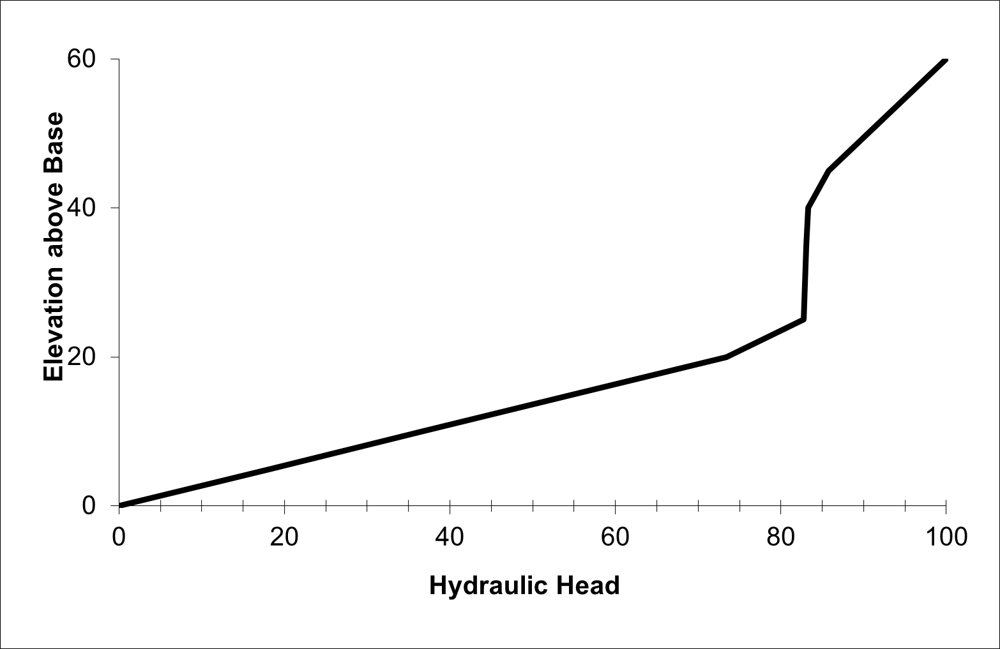

# Abigail Kahler - HW 1 - 01/27/2022

# The Challenge

**1** A system in steady state has no change in storage: the flux in equals the flux out.

For a **homogeneous** column (above), the hydraulic conductivity (K) is the same throughout. Then,\
by q = -K (dh/dl) the flux is also constant along the entire column.

For a **heterogeneous** column (above), different K values between layers dictate different fluxes as\
well, yet to be steady state the flux in and flux out of the column must be equal.

**2** The harmonic mean of hydraulic conductivity (Keq) is used to calculate flux in\
heterogeneous columns. The direct calculation is:\
q = -K(dh/dl), where K = Keq = n/((1/K1)+(1/K2)) and n = the number of layers

**3** 

**4** Hydraulic conductivity describes the 'ease' with which a fluid can pass through a medium.\
In a head profile, lower K corresponds to a shallow slope because it takes longer to travel\
the length of that layer. Keq is closer to the lower K value because that is where the\
greatest head loss occurs.

# The Discussion

**1** *Boundary conditions* give a starting point for iterative numerical solutions:\
they give a reference point for reducing the number of unknowns to solve for\
in the mathematical equations. Conceptually, a boundary condition represents physical\
characteristics such as the flow into or out of the system or the head gradient.

**2** *Model parameters* are abstractions of physical properties. For subsurface hydrology, it is\
difficult and expensive to collect definitive data for each characteristic that will\
determine the behavior of the system. The data that are available are typically from\
a point source, whereas the model is on a greater watershed or aquifer or regional scale.\
Parameters, set to within a range of known likely values, allow us to feed plausible\
information into the model to output plausible - with uncertainty - outcomes.

**3** *Steady state* conditions indicate no change of storage in the system: flux in = flux out\
This is shown in the Excel model by the vertical distribution of flux with column depth.

**4** Sometimes it is more efficient to have self-contained files or functions that can be called\
into the active model script. This is helpful for an end-member user who does not need to\
monitor or change the model structure; only the active inputs.\

**5** An *iterative solution* is like starting a decision process with an educated guess. You want\
to buy a used car and you think it will cost $5000. While you are saving up that amount, you\
begin to shop around and begin to gather more information about the total cost. This will likely\
require you to adjust your budget +/- one or two thousand dollars. Starting with a reasonable\
guess does not hurt the validity of your decision-making, but actually gives you a leg up in preparedness. Excel Solver is great for this: you input a
plausible guess and then set conditions\
that must be met for specific paramters, and it does this process for you.

However- there are 'holes' of minima and maxima that can  trap the model solution. For\
example, looking for a car in the $5000 range is very specific and will overlook $8000 cars\
that might actually be economically better choices.

**6** A *direct solution* is typically for systems that are more readily solvable, either by their\
physical simplicity or the number of known parameters. The disadvantage is that this is\
often not the case and it will require too many simplifying assumptions for the final\
result to stand up.

